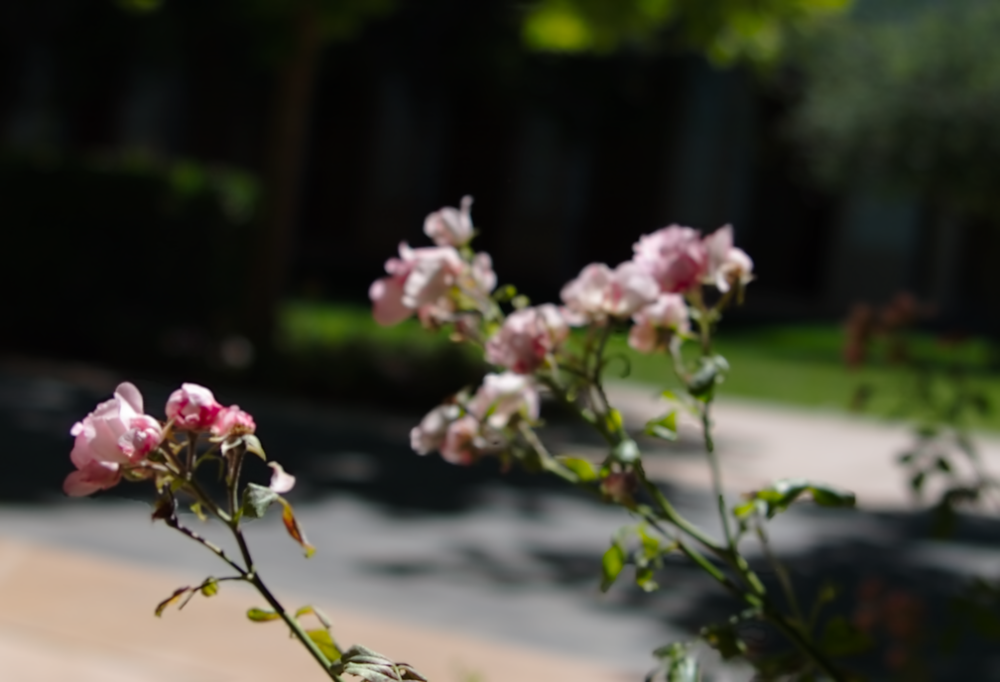
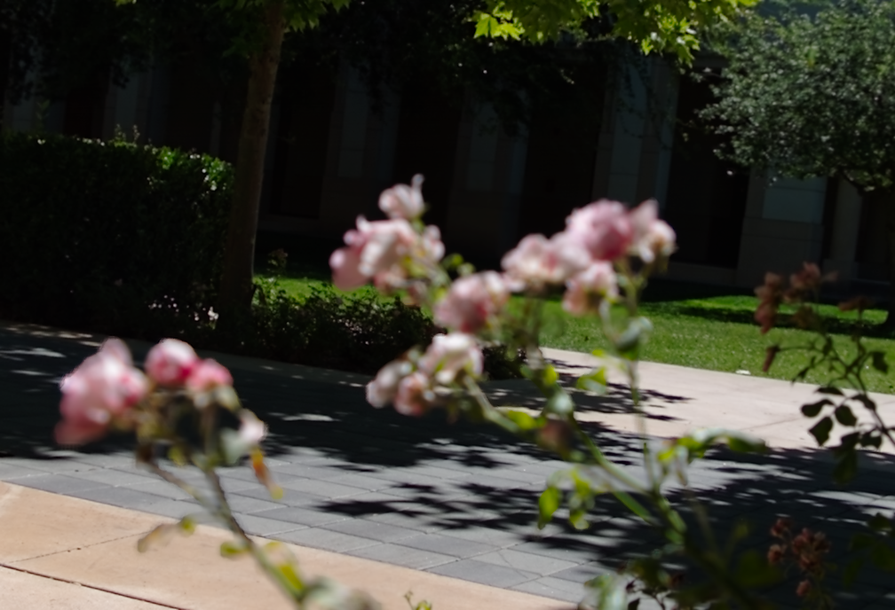
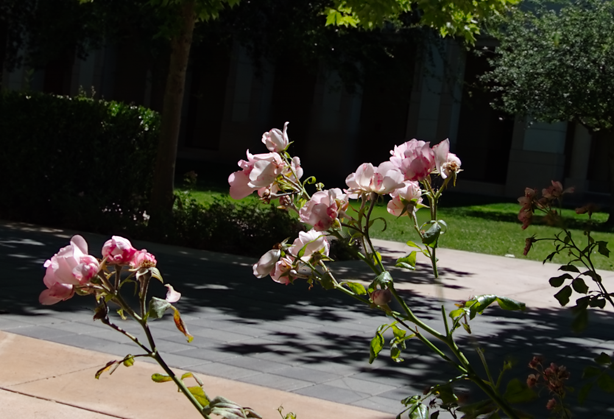
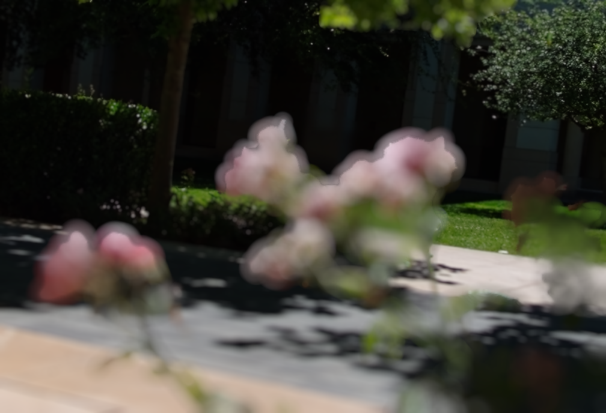

# BRnFS

BRnFS is a computational photography suite with two runnable image workflows:

- **Bokeh rendering**: synthesize shallow depth of field from one all-sharp RGB
  image using DPT depth prediction, LDF saliency/alpha estimation, LaMa
  inpainting, and DScatter rendering.
- **Focus stacking**: fuse a multi-focus image stack into one all-in-focus image
  using alignment, Laplacian pyramids, sharpness maps, and mask-based fusion.

The project provides a unified `python -m brnfs` CLI, a Tkinter GUI, sample
inputs, setup scripts for the pinned Python 3.9 runtime, and reproducible README
demo assets.

## What You Can Run

- Launch a two-tab GUI for bokeh rendering and focus stacking.
- Run each workflow from the CLI on the included examples.
- Check local prerequisites with `brnfs doctor`.
- Regenerate the README figures from the example inputs.

Focus stacking can run on CPU. Bokeh rendering is practical only when the model
weights are present and the CUDA `scatter_cuda` extension is available.

## Quick Start

Requirements:

- Python 3.9
- Linux/WSL2 or Windows PowerShell
- CUDA 11.7-compatible PyTorch and CUDA toolkit for practical bokeh rendering
- NVIDIA GPU recommended for bokeh rendering; not required for focus stacking

Linux / WSL2:

```bash
bash setup.sh
source .venv/bin/activate
python -m brnfs doctor
python -m brnfs gui
```

Windows PowerShell:

```powershell
Set-ExecutionPolicy -Scope Process -ExecutionPolicy Bypass
.\setup.ps1
.\.venv\Scripts\Activate.ps1
python -m brnfs doctor
python -m brnfs gui
```

The setup scripts create `.venv`, install the pinned dependency stack, ensure
the bokeh model weights, install the project in editable mode, and attempt to
build `scatter_cuda`.

Useful setup overrides:

```bash
PYTHON_BIN=python3.9 bash setup.sh
BRNFS_SKIP_WEIGHTS=1 bash setup.sh
BRNFS_SKIP_SCATTER_CUDA=1 bash setup.sh
CUDA_HOME=/usr/local/cuda-11.7 bash setup.sh
```

PowerShell uses the same environment variable names, for example:

```powershell
$env:BRNFS_SKIP_SCATTER_CUDA = "1"
.\setup.ps1
```

## CLI Usage

All public commands are exposed through `python -m brnfs` and, after editable
install, the `brnfs` console script.

Launch the GUI:

```bash
python -m brnfs gui
```

Check prerequisites:

```bash
python -m brnfs doctor
python -m brnfs doctor --focus
python -m brnfs doctor --bokeh
```

Run focus stacking on the included focus stack:

```bash
python -m brnfs focus \
  --dataset examples/focus/IMG_2649 \
  --output outputs/focus/IMG_2649_fused.png \
  --levels 3 \
  --mask soft \
  --top mean \
  --sharpness Tenengrad+Blur
```

Run bokeh rendering on the included all-sharp image:

```bash
python -m brnfs bokeh \
  --rgb examples/bokeh/IMG_2649.png \
  --output outputs/bokeh/IMG_2649_bokeh.png \
  --k-blur 30.0 \
  --focal 0.10 \
  --lens 71 \
  --gamma 2.2
```

Generate or refresh the README demo assets:

```bash
python -m brnfs demo-assets --output docs/assets/readme
```

If bokeh prerequisites are incomplete, `demo-assets` still generates the focus
stacking assets and records the skipped bokeh step in
[`docs/assets/readme/demo_status.md`](docs/assets/readme/demo_status.md).

## Demo Results

The figures below are generated from the included examples under `examples/`.
The latest generation status is recorded in
[`docs/assets/readme/demo_status.md`](docs/assets/readme/demo_status.md).

### Focus Stacking

Input: multiple images of the same scene focused at different depths.
Output: one all-in-focus image assembled from the sharp regions of the stack.

| Near / first focus frame | Middle focus frame | Far / last focus frame | Fused output |
| --- | --- | --- | --- |
|  |  |  |  |

### Bokeh Rendering

Input: one all-sharp RGB image. Output: a synthetic shallow-depth-of-field image
computed from estimated disparity, foreground/background separation, inpainted
background content, and depth-aware scatter rendering.

| All-sharp input | Rendered bokeh |
| --- | --- |
|  |  |

## Inputs, Outputs, And Caches

- `examples/bokeh/*.png`: single RGB images for bokeh rendering.
- `examples/focus/<dataset>/*.png`: one directory per focus stack dataset.
- `models/dpt/`, `models/ldf/`, `models/lama/`: model weights used by the bokeh
  pipeline.
- `outputs/bokeh/`: rendered bokeh images.
- `outputs/focus/`: fused focus-stacking images.
- `outputs/cache/bokeh/`: cached depth, alpha, and layered RGBAD preprocessing.
- `outputs/cache/focus/`: cached aligned focus stacks.

Generated outputs and caches are runtime artifacts and are not required for a
fresh checkout.

## Repository Layout

```text
brnfs/                 # canonical package and unified CLI
  cli.py               # command parser for python -m brnfs / brnfs
  paths.py             # central repository path registry
  ui/                  # Tkinter GUI entry point and tabs
  focus/               # focus stacking runner
  bokeh/               # bokeh namespace
  cuda_src/            # scatter_cuda C++/CUDA extension source
app/                   # adapted algorithm modules and vendored integration code
examples/
  bokeh/               # single-image bokeh sample inputs
  focus/               # multi-focus sample stacks
models/                # model weight locations
outputs/               # generated outputs and runtime caches
docs/
  architecture.md      # pipeline details and Mermaid diagrams
  assets/readme/       # README demo images
scripts/               # helper scripts for demo assets and CUDA rebuilds
vendor/                # reserved third-party source namespace
```

For pipeline diagrams and module boundaries, see
[`docs/architecture.md`](docs/architecture.md).

## CUDA Extension

The bokeh renderer uses `scatter_cuda` for practical performance. The setup
scripts build it automatically when CUDA is available. To rebuild it manually
inside an activated environment:

```bash
bash scripts/build_scatter_cuda.sh
```

Windows PowerShell:

```powershell
.\scripts\build_scatter_cuda.ps1
```

The Linux build script checks that `nvcc` matches `torch.version.cuda` and uses a
GCC/G++ version compatible with CUDA 11.7 when possible.

## Troubleshooting

- `python: command not found`: activate `.venv` first, or call
  `.venv/bin/python -m brnfs ...` directly on Linux/WSL2.
- Missing `cv2`: run `bash setup.sh` or `.\setup.ps1`; OpenCV is installed with
  a pinned wheel and `--no-deps`.
- Missing model weights: run setup without `BRNFS_SKIP_WEIGHTS=1`.
- Missing `pkg_resources`: install `setuptools<81`; the setup scripts pin this
  because older vendored imports still expect it.
- Missing `scatter_cuda`: rebuild with `bash scripts/build_scatter_cuda.sh` or
  `.\scripts\build_scatter_cuda.ps1`.
- CUDA mismatch: use a CUDA toolkit compatible with the installed PyTorch wheel.
  The setup scripts target CUDA 11.7.
- Bokeh rendering is extremely slow: confirm `python -m brnfs doctor --bokeh`
  reports `scatter_cuda` as present and that PyTorch can see CUDA.

## Third-Party Code And Licensing

This repository integrates DPT, LaMa, and LDF/Dr.Bokeh-style components for
inference. Preserve [`THIRD_PARTY_NOTICES.md`](THIRD_PARTY_NOTICES.md) and the
available license texts under `LICENSES/` when redistributing.

This checkout does not include a standalone root `LICENSE` file. Treat public
redistribution of the combined project as pending license review, especially for
vendored components without an in-tree license file.
