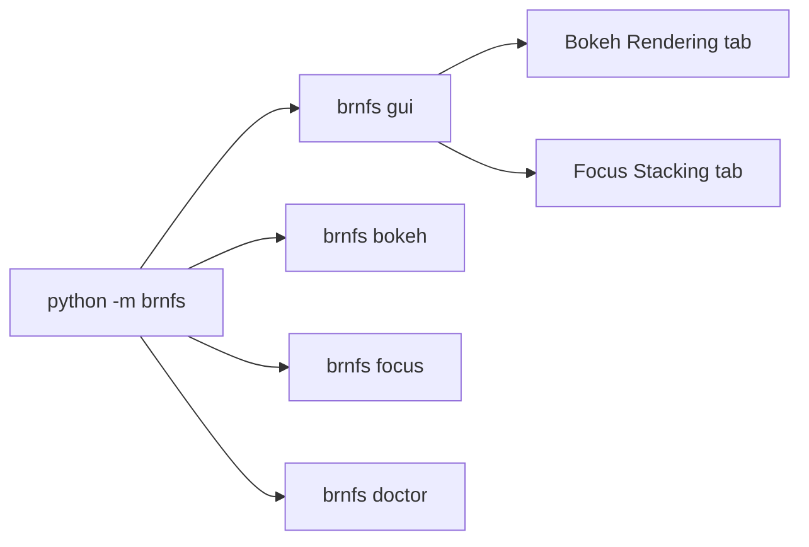
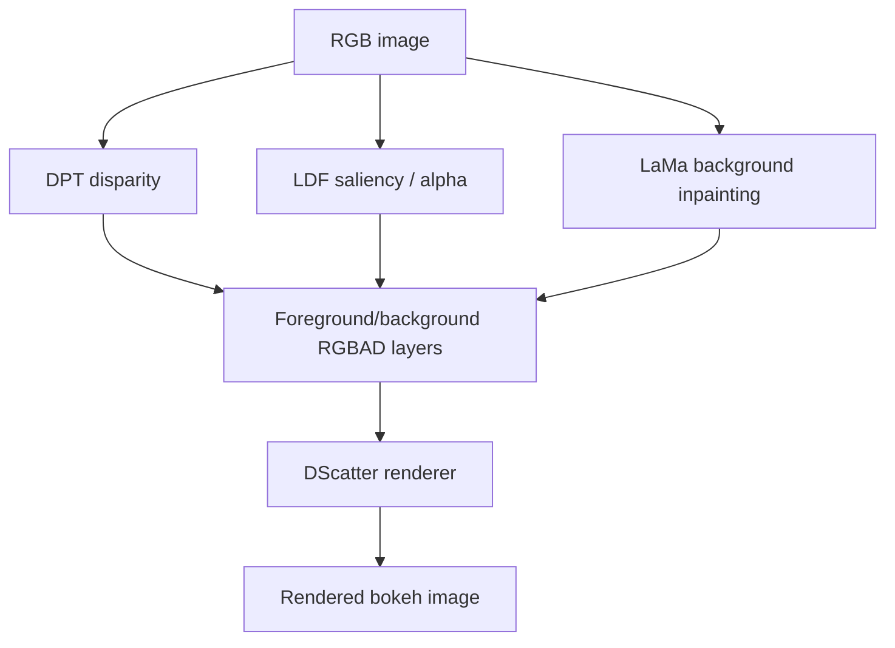
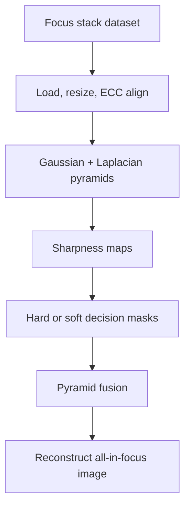

# BRnFS Architecture

BRnFS combines two independent image-processing pipelines behind one CLI and GUI. The `brnfs` package owns the public entry points and path registry; algorithm code that originated from the source projects remains under `app/`.

## Entry Points



The public command surface is `python -m brnfs` or the installed `brnfs` console script.

## Bokeh Rendering Pipeline



The bokeh path uses:

- `models/dpt/` for DPT depth weights.
- `models/ldf/` for LDF/ResNet weights.
- `models/lama/` for LaMa checkpoints.
- `outputs/cache/bokeh/` for preprocessed RGBAD layers.

`scatter_cuda` is the fast renderer backend. If it is unavailable, the code can fall back to a Python/CPU reference implementation, but this is too slow for normal demo use.

## Focus Stacking Pipeline



Focus stacking reads datasets from `examples/focus/<dataset>/`, writes final images under `outputs/focus/`, and caches aligned stacks under `outputs/cache/focus/`.

## Path Policy

All new code should import paths from `brnfs.paths`; root-relative data/model/output paths should not be hardcoded elsewhere.

Canonical data locations:

```text
examples/       sample inputs
models/         downloaded weights
outputs/        generated outputs and caches
docs/assets/    documentation assets
```
